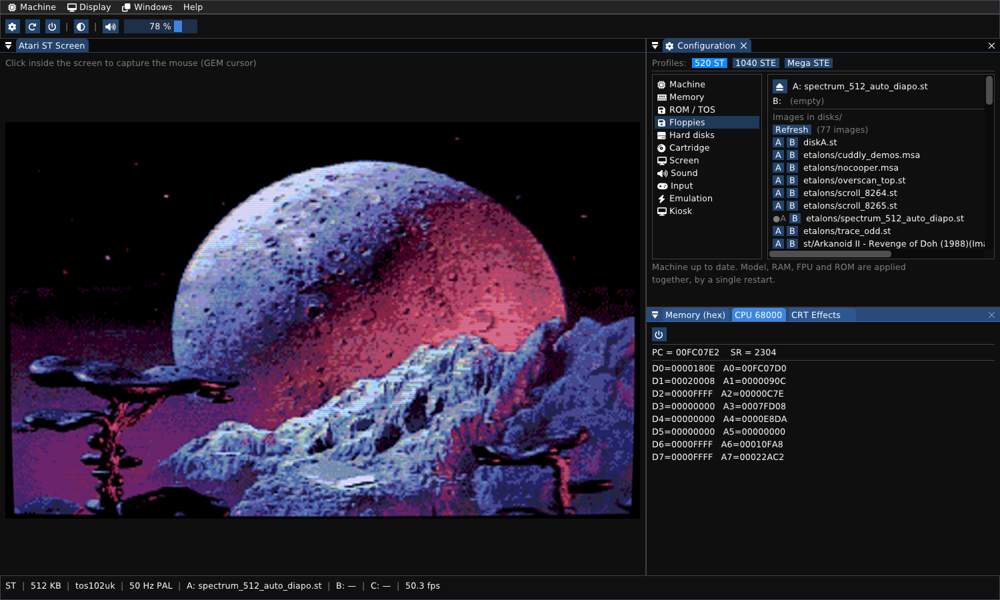

# NeoST

**An Atari ST you can open up, understand, and tinker with — chip by chip.**

Most emulators are black boxes: they run the games and hide the machine. NeoST is the
opposite. Every chip — the Shifter, the YM2149, the MFP 68901, the WD1772 floppy
controller, the MMU/GLUE, the blitter — is modelled separately and wired onto a `Bus`
that **is** the memory map, exactly the way the real silicon sits on the real board. You
watch RAM, the 68000 registers and the chip state live while your game runs.

> (c) 2026 VERHILLE Arnaud · C++17 · Linux / macOS Silicon / Windows · **and in your browser**



*That planet is a real Atari ST screen: 512 colours out of a machine that officially does
16, by rewriting the palette mid-scanline. NeoST renders it pixel-for-pixel identical to
the Hatari reference.*

## Try it right now — nothing to install

### 👉 **[habib256.github.io/neost](https://habib256.github.io/neost/)**

The same emulation core, compiled to WebAssembly. Pick a ROM, mount a floppy, flip
between colour and mono, or **drag your own `.st` onto the screen**. No download, no
account, no build.

## Why you might like it

🔬 **You can see everything.** The `Bus` routes every access to the right chip and hides
nothing. If you have ever wanted to *learn* how a 16-bit machine actually works, this is
a machine with the lid off.

⚙️ **It is honest about timing.** The 68000 core is [Moira](https://github.com/dirkwhoffmann/Moira),
cycle-exact down to inter-instruction timing, IPL sampled per cycle and bus contention.
Hardware behaviour is ported register by register from
[Hatari](https://hatari.tuxfamily.org/) and MAME — and checked against Hatari as a
running oracle, not just read.

🖥️ **Four real machines.** ST, Mega ST, STE, Mega STE, chosen before boot, with the
optional hardware correctly present or absent per model. The Mega STE gets its 8/16 MHz
68000, its cache, and an **emulated MC68881 FPU** — which even Hatari does not do.

🐞 **A debugger that earns its keep.** Breakpoints, memory watchpoints, cycle-accurate
single-stepping, symbols (`.sym` or straight out of a TOS executable), annotated
disassembly, live hex and registers. All of it also available **headless and
deterministic** — which is how you find out why that one demo hangs.

💾 **Save-states that really restore.** The complete machine — CPU, RAM, every chip — to
the byte. <kbd>F5</kbd> saves, <kbd>F7</kbd> loads, and the restored run is
bit-for-bit identical.

🔊 **Sound all the way down.** YM2149 with noise and envelopes, STE DMA sound,
Microwire/LMC1992 filters — and the mechanical clatter of the floppy drive, because of
course.

🕹️ **Arcade cabinet mode.** Full screen, no chrome, frozen config, entirely
gamepad-driven. Point it at a Raspberry Pi and you have a machine for the living room.

## Get it

Every release ships **7 packages** with SHA-256 sums:

| Package | For |
|---------|-----|
| `NeoST-<ver>-x86_64.AppImage` | Linux Intel/AMD — glibc ≥ 2.27, so old distros too |
| `NeoST-<ver>-aarch64.AppImage` | Linux ARM64, generic |
| `NeoST-<ver>-raspberry-aarch64.AppImage` | **Raspberry Pi 3 → Pi 5.** When in doubt, this one |
| `NeoST-<ver>-pi400-aarch64.AppImage` | **Pi 4 / Pi 400 only** — `-mcpu=cortex-a72`, ~10-20 % faster, won't start on older cores |
| `NeoST-<ver>-macOS-universal2.dmg` | macOS **Universal 2** (Apple Silicon + Intel) |
| `NeoST-<ver>-windows-x86_64.zip` | **Windows 10/11 x64** — unzip and run, everything is linked statically |
| `NeoST-<ver>-web-wasm.zip` | WebAssembly, to serve from any web server |

The Windows package is **unsigned**: SmartScreen will warn you on first launch
(*More info* → *Run anyway*).

### Build from source

You need **GLFW3** (`brew install glfw`, `pacman -S glfw`, `apt install libglfw3-dev`)
and OpenGL from your system. The 68000 core is vendored — nothing to fetch.

```sh
git submodule update --init --recursive
cmake -B build -DCMAKE_BUILD_TYPE=Release
cmake --build build -j
./build/neost                                    # picks up your last ROM, or EmuTOS
./build/neost roms/etos192fr.img disks/diskA.st  # or be explicit
```

`roms/` and `disks/` are resolved both from the current directory and from the
executable, so running from the repository root or from `build/` both work.

## Using it

Click inside the ST screen to capture the mouse (you are then driving the GEM cursor);
<kbd>Del</kbd> releases it. The keyboard goes straight to the IKBD. Everything else —
machine model, memory, ROM, floppies, hard disks, sound, CRT look — lives in one
**Configuration** window, and the status bar at the bottom always tells you what machine
you are actually running.

| Key | Action |
|-----|--------|
| <kbd>F5</kbd> / <kbd>F7</kbd> | Save / load state |
| <kbd>F8</kbd> | Toggle kiosk (cabinet) mode |
| <kbd>F11</kbd> | Keyboard joystick (arrows + right Ctrl) |
| <kbd>F12</kbd> | Capture the mouse |
| <kbd>Del</kbd> | Release the mouse |

**Floppies** — drop a `.st`, `.msa`, `.dim` or `.stx` (Pasti, for copy-protected games)
onto the window, or mount it from the Configuration window. Writes are persisted back to
the image.

**Hard disks** — two ways. Drop a *folder* on the window and it becomes drive **C:** via
GEMDOS redirection (Hatari's trick: no controller emulation, your real files). Or mount a
real ACSI disk image and let TOS read its partition table.

**Cabinet mode** (`--kiosk`, or <kbd>F8</kbd>) — exclusive full screen, no window
chrome, configuration frozen so the cabinet always restarts identical, and an in-game
menu on **START** to swap games, remap pads or send keystrokes without ever leaving full
screen. The whole thing is drivable from a gamepad. Details, including the Raspberry Pi
cabinet build: [`docs/KIOSK.md`](docs/KIOSK.md).

**CRT look** (`--crt`, or *Display → CRT effects*) — an opt-in shader pass that puts the
glass of an old monitor back in front of the pixels: barrel geometry, scanlines, shadow
mask, phosphor persistence. Presets `light`, `arcade`, `phosphor`, then tweak every
slider live. If the shader can't compile, you simply get the raw screen.

## ROMs

NeoST boots **[EmuTOS](https://emutos.sourceforge.io/)** (GPL) out of the box, so it
works with no proprietary ROM at all. The packages also carry **TOS 1.02 UK** and
**TOS 1.62 UK** for the 520 ST and 1040 STE profiles.

⚠️ The ROM decides the scan rate: a `us` suffix means **60 Hz NTSC**, while
`uk`/`fr`/`de`/`es` mean **50 Hz PAL**. European demos come out visibly torn at 60 Hz —
faithfully so, that is what real hardware does. If a demo looks wrong, check the status
bar first.

## Documentation

| File | What's in it |
|------|--------------|
| [`DEV.md`](DEV.md) | Architecture, clock model, headless debugging, hardware gotchas, how to add a chip |
| [`CHANGELOG.md`](CHANGELOG.md) | Release history and dated work |
| [`docs/IMPLEMENTED.md`](docs/IMPLEMENTED.md) | What is implemented, chip by chip — "does NeoST do X?" |
| [`TODO.md`](TODO.md) | What is left — game catalogue and per-subsystem roadmap |
| [`CLAUDE.md`](CLAUDE.md) | Working method and sources of truth (also the map to everything else) |
| [`docs/`](docs/) | Deep dives: cycle accuracy, Hatari divergences, headless oracle, reference software |

## Status

**0.5.1.** EmuTOS and TOS 1.02/1.62/2.06 boot; all three Field Service diagnostic
cartridges pass their internal tests. Demanding games and demos run: Enchanted Land,
Super Hang-On, Lethal Xcess, The Cuddly Demos, No Cooper. Spectrum 512 pictures and
No Cooper's med-res overscan come out **0 pixels different** from the Hatari oracle
(`tools/run_all.py --tier full`).

The long game is **cycle accuracy** — borders and the fine timing of games and demos.
See [`TODO.md`](TODO.md) and [`docs/CYCLE_ACCURACY.md`](docs/CYCLE_ACCURACY.md).

The interface and log messages are in English; code comments and documentation are in
French.

## Licence

**GNU GPL v3** (see [`LICENSE`](LICENSE)) — (c) 2026 VERHILLE Arnaud. Hardware behaviour
is largely ported from [Hatari](https://hatari.tuxfamily.org/) (GPLv2+), to which NeoST
owes a great deal; GPLv3 is compatible with that port.

Bundled third-party components, with thanks:

| Component | Role | Licence |
|-----------|------|---------|
| [Moira](https://github.com/dirkwhoffmann/Moira) (vendored) | cycle-exact 68000 core | MIT — © Dirk W. Hoffmann |
| [Dear ImGui](https://github.com/ocornut/imgui) (submodule) | interface | MIT |
| [miniaudio](https://miniaud.io/) (submodule) | audio output | MIT-0 / public domain |
| [EmuTOS](https://emutos.sourceforge.io/) (`roms/etos*`) | free TOS, the default | GPLv2 |
| DejaVu / Font Awesome | UI fonts | respective free licences |

[Hatari](https://framagit.org/hatari/hatari) and MAME are the **behavioural references**
— read as sources, and run as an oracle.
