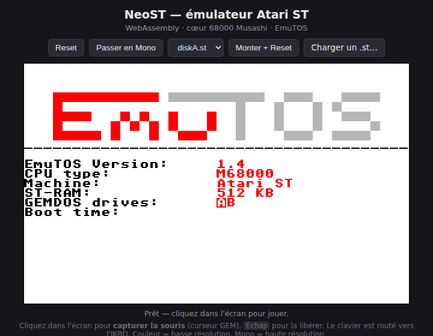

# NeoST

**Un Atari ST que vous pouvez ouvrir, comprendre et bidouiller — puce par puce.**

NeoST est un émulateur Atari ST « boîte à hack » pédagogique : au lieu d'une boîte
noire qui « fait tourner les jeux », c'est une **carte mère transparente**. Chaque
composant (Shifter vidéo, YM2149, MFP 68901, FDC WD1772, MMU/GLUE, blitter…) est
modélisé séparément et **branché sur un `Bus` qui *est* le plan mémoire**, exactement
comme les puces sont câblées sur la vraie carte. On voit la RAM, les registres 68000
et l'état des puces vivre en direct.

> (c) 2026 VERHILLE Arnaud — C++17 · macOS Silicon / Linux · **et dans le navigateur**.

## ▶ Essayer tout de suite (sans rien installer)

**Démo WebAssembly : <https://habib256.github.io/neost/>**

Le même cœur d'émulation, compilé en WASM, tourne dans votre navigateur. L'interface
permet de **tout tester sans recompiler** : choix de la ROM (EmuTOS US/FR, TOS 1.02),
montage de disquettes, bascule couleur/mono, et **upload** de votre propre `.st`.



## Pourquoi NeoST

- 🔬 **Transparence matérielle totale** — le `Bus` route chaque accès vers la bonne
  puce ; rien n'est caché. Idéal pour *apprendre* comment un ST fonctionne vraiment.
- 🧩 **Modélisation puce par puce, fidèle Hatari** — le comportement matériel est
  porté registre par registre depuis [Hatari](https://hatari.tuxfamily.org/) et MAME,
  les références de l'émulation Atari. Les vraies **cartouches de diagnostic Field
  Service** (ST / STE / MegaSTE) passent leur batterie de tests internes sans erreur.
- 🖥️ **4 profils machine** — ST, Mega ST, STE, Mega STE, choisis avant le boot, avec
  le matériel optionnel correctement présent/absent selon le modèle. Sur Mega STE :
  68000 8/16 MHz + cache, et **FPU MC68881 émulé** (socket périphérique `$FFFA40`,
  option `--fpu` / menu Modèle — chose qu'Hatari n'émule pas).
- ⚙️ **Cœur 68000 cycle-exact** — [Moira](https://github.com/dirkwhoffmann/Moira)
  (timing inter-instructions, IPL échantillonné au cycle, contention de bus).
- 🐞 **Débogueur intégré** — visualiseur hexa de la RAM et registres 68000 en direct
  (Dear ImGui), plus un **mode headless déterministe** qui produit des traces façon
  MAME (l'arme secrète pour diagnostiquer un jeu qui bloque).
- 🔊 **Son complet** — YM2149 (3 voies + bruit + enveloppe), son DMA STE, filtres
  Microwire/LMC1992, et même les **bruits mécaniques du lecteur** de disquette.
- 🌐 **Multi-plateforme** — macOS Silicon, Linux, et WebAssembly. Une seule base de code.

## Démarrage rapide

### Dépendances

- **GLFW3** — `brew install glfw` (macOS) / `pacman -S glfw` (CachyOS/Arch)
- **OpenGL** — fourni par le système (framework Apple / Mesa)
- Sous-modules : `extern/moira` (cœur 68000), `extern/imgui`, `extern/miniaudio`

```sh
git submodule update --init --recursive
# Aucune étape de génération : Moira se compile tel quel (C++20).
```

### Build & run

```sh
cmake -B build -DCMAKE_BUILD_TYPE=Release
cmake --build build -j                          # cibles : neost, neost-headless, neost_core
./build/neost                                   # auto : dernier ROM (neost.cfg) ou EmuTOS US
./build/neost roms/etos192fr.img disks/diskA.st  # ROM + disquette explicites
```

> Les chemins par défaut (`roms/`, `disks/`) sont résolus depuis le répertoire courant
> **et** depuis l'exécutable — `./neost` marche aussi bien depuis la racine que `build/`.

### Contrôles

| Touche     | Action                       |
|------------|------------------------------|
| F12        | Reset physique virtuel       |
| Suppr (DEL)| Libère la capture souris     |

Clic dans l'écran ST = capture de la souris (curseur GEM) ; le clavier est routé vers
l'IKBD. Le GUI ajoute un menu **Machine** (modèle, mémoire, cœur CPU) et une
**Disk Library** (monter/éjecter à chaud).

## Mode kiosk (borne / expo)

Pour une borne d'exposition : plein écran **sans le chrome de bureau** (ni barre de
menu, ni fenêtres ImGui), image centrée, configuration **figée** (la borne repart
toujours identique) — mais avec un **menu in-game** manette/clavier pour changer de
jeu, envoyer des touches ou redémarrer, sans jamais quitter le plein écran.

```sh
./build/neost --kiosk           roms/tos102uk.img "disks/Jeu.stx"   # plein écran sans bordure
./build/neost --kiosk-exclusive roms/tos102uk.img "disks/Jeu.stx"   # plein écran EXCLUSIF (recommandé)
./build/neost --kiosk-exclusive --kiosk-monitor 1 roms/tos162fr.img  # sur le 2ᵉ écran
```

- **`--kiosk`** : fenêtre plein écran *sans bordure* (« borderless-windowed »), toujours au
  premier plan. Simple, mais un bureau à panneaux « toujours au-dessus » (GNOME Shell…)
  peut la recouvrir.
- **`--kiosk-exclusive`** : vrai plein écran **exclusif** — reste au-dessus de tout, garde le
  focus clavier. **À préférer** pour une vraie borne. (`--kiosk` est impliqué.)
- **`--kiosk-monitor N`** : écran cible (0 = principal).

En kiosk : la souris est capturée et le curseur masqué ; l'**émulation joystick au
clavier est activée** (flèches + Ctrl droit = feu) pour jouer sans manette ; le fichier
`neost.cfg` n'est **jamais** réécrit.

**Zoom adaptatif** (défaut, bascule **F10**) : la **zone active** (l'écran ST « de base »,
hors bandes overscan) est calée sur la hauteur en gardant le ratio pixel — un jeu normal
remplit l'écran autant qu'une démo, sans être rapetissé par des bordures unies qu'il
n'exploite pas (barres noires latérales seulement). Dès qu'une démo **ouvre les bordures**
(overscan — Enchanted Land, Lethal Xcess…), la Glue le signale et NeoST montre le **buffer
entier** (hystérésis anti-clignotement). F10 fige au contraire le cadre complet en permanence.

**Menu in-game** (**START** manette ou **F9**) : plein écran, le jeu est **mis en pause**.
Libellés en **anglais** (borne). Deux colonnes que l'on bascule gauche/droite — la **liste des
jeux** (triée par proximité : les phases B/C/D du jeu en cours remontent en tête, **L1/R1** =
défilement rapide par page) et les **actions** (*Restart machine* / *Keyboard & mouse* /
*ROM folders* / *Quit*). Le FEU (A / Entrée) valide. Insérer un jeu **échange la disquette à
chaud, sans reboot** (comme glisser une disquette : le jeu en cours continue) ; seul
« Restart » relance la machine.

**Clavier & souris** (**SELECT** manette ou **K**, même en cours de jeu) : un bandeau en bas
sans mettre le jeu en pause — on envoie une frappe brève (touches F1-F8, chiffres, Espace/
Return/Escape, clics souris) au jeu qui tourne dessous.

**Dossiers ROM** (action *ROM folders*) : ajouter d'autres dossiers de jeux/disques, scannés
**en plus** de `disks/`. Un **navigateur piloté à la manette** parcourt tout le système de
fichiers (chemin absolu → remontée jusqu'à `/`) avec des **raccourcis** vers la racine, le
*Home* et les **volumes montés** (`/Volumes` sur macOS, `/run/media`·`/media`·`/mnt` sur
Linux). *USE THIS FOLDER* ajoute ; chaque dossier se retire d'une **croix ×** (et est
auto-supprimé s'il n'existe plus). La liste est **persistée** dans `neost.cfg` (`kiosk_romdir=`).

| Touche / bouton          | Action                                             |
|--------------------------|----------------------------------------------------|
| Flèches / Ctrl droit     | Joystick émulé (direction / feu)                   |
| **F9** / START           | Ouvre/ferme le menu in-game (jeu en pause)         |
| **K** / SELECT           | Ouvre/ferme le bandeau Clavier & souris            |
| **L1 / R1** (Page↑/↓)    | Défilement rapide par page dans la liste des jeux  |
| **F10**                  | (dés)active le zoom adaptatif (cadre complet fixe) |
| **F11**                  | (dés)active l'émulation joystick clavier           |
| A·B / Entrée·Échap       | Valider / revenir (dans le menu)                   |
| **Alt+F4**               | **Quitter la borne** (immédiat, le classique)      |
| **Ctrl+Shift+Q** (~0,7 s)| Quitter la borne (chord discret)                   |

> Démarrage direct sur un jeu (attract) : monter un dossier GEMDOS
> (`NEOST_GEMDOS_DIR=…`) dont le `DESKTOP.INF` (TOS 1.x) ou `NEWDESK.INF` (TOS 2.x)
> contient une ligne d'autostart `#Z 01 C:\JEU.TOS@`.

## Effets CRT (façade moniteur)

Option **opt-in** : une passe shader (FBO) applique par-dessus l'écran ST la « façade
verre » d'un vieux moniteur cathodique — géométrie de baril, scanlines, shadow mask,
rémanence phosphore, luminosité/contraste/saturation/teinte, vignette et courbe gamma.
Sans surprise : à échec gracieux (si le shader ne compile pas — ex. contexte GL 2.1 sur
un vieux macOS — l'écran est présenté **brut**, passthrough).

```sh
./build/neost --crt                         # active les effets (réglages du neost.cfg)
./build/neost --crt-preset arcade           # preset : off | leger | arcade | phosphor
./build/neost --kiosk --crt-preset phosphor roms/tos162fr.img "disks/Jeu.stx"
```

En **fenêtré**, le menu **Affichage → Effets CRT** ouvre un panneau de réglages en direct
(chaque curseur est persisté dans `neost.cfg`). Un preset n'est qu'un point de départ : on
peut ensuite tout ajuster. En **kiosk**, la config est figée → les effets viennent du
`neost.cfg` (ou de `--crt` / `--crt-preset`).

## ROM : EmuTOS par défaut (libre)

Les TOS Atari d'origine sont propriétaires et **ne sont pas redistribués** ici. NeoST
utilise par défaut **[EmuTOS](https://emutos.sourceforge.io/)** (GPL), dans `roms/` :

```
roms/etos192fr.img   EmuTOS 192 Ko, français  (mappé à $FC0000, par défaut)
roms/etos192us.img   EmuTOS 192 Ko, US
```

## Disquettes

Le lecteur A monte une image `.st` (dump de secteurs brut ; `.msa` aussi supporté).
Une image FAT12 720 Ko de démonstration est fournie dans `disks/diskA.st`. Outils :

```sh
python3 tools/make_floppy.py                 # (re)génère disks/diskA.st (FAT12 de test)
python3 tools/fetch_disk.py <url planetemu>  # télécharge une disquette de test (scrapling)
```

> ⚠ `fetch_disk.py` n'est à utiliser que pour des logiciels auxquels vous avez droit
> (domaine public, freeware, démos), afin de tester l'émulateur.

## Disque dur GEMDOS (dossier hôte → C:)

Plutôt qu'émuler un contrôleur ACSI/IDE, NeoST peut monter un **dossier de l'hôte**
comme lecteur **C:** en interceptant les appels GEMDOS et en les redirigeant vers le
système de fichiers réel (technique d'Hatari). Lire, écrire, lister et **lancer des
programmes** depuis C: fonctionnent ; un PRG placé dans `C:\AUTO\` est exécuté au boot.

```sh
./build/neost-headless roms/etos192us.img --gemdos /chemin/vers/dossier   # headless
NEOST_GEMDOS_DIR=/chemin/vers/dossier ./build/neost                       # fenêtré
```

Le bureau EmuTOS affiche alors une icône **DISK C** (disque dur). Si le dossier ne
contient QUE des sous-dossiers d'une lettre (`C`, `D`…), chacun devient un lecteur.
Exclusif d'une cartouche externe (`--cart`).

## Disque dur ACSI (vraie image de disque)

Pour booter depuis une **image de disque dur** réelle (dump de secteurs brut avec
table de partitions Atari/AHDI ou DOS), NeoST émule le contrôleur ACSI (port de
`hdc.c`). Le TOS/EmuTOS détecte le périphérique, lit la table de partitions et monte
les partitions FAT (C:, D:…). Lecture **et écriture** sont persistées dans l'image.

```sh
./build/neost-headless roms/etos192us.img --acsi disque.hd        # headless (alias --hd)
NEOST_ACSI_IMG=disque.hd ./build/neost                            # fenêtré
```

Contrairement au disque dur GEMDOS (redirection vers un dossier), l'ACSI utilise un
vrai système de fichiers FAT dans l'image — idéal pour booter un environnement Atari
complet. Jusqu'à 8 cibles. Indépendant du disque dur GEMDOS.

## Build WebAssembly (local)

Nécessite l'[emsdk](https://emscripten.org/docs/getting_started/downloads.html) activé
(`source .../emsdk_env.sh`). La cible `neost-web` écrit dans `wasm/` :

```sh
emcmake cmake -B build-web -DCMAKE_BUILD_TYPE=Release
cmake --build build-web -j --target neost-web    # → wasm/index.{html,js,wasm,data}
python3 -m http.server -d wasm 8000              # puis ouvrir http://localhost:8000/
```

`-DNEOST_WEB_FREE_ONLY=ON` réduit la build aux seuls contenus libres (EmuTOS + `diskA`).
Le déploiement GitHub Pages est automatisé par `.github/workflows/deploy-web.yml`.

## Documentation

| Fichier                        | Contenu                                                       |
|--------------------------------|--------------------------------------------------------------|
| [`DEV.md`](DEV.md)             | Architecture détaillée, modèle d'horloge, débogage headless, pièges matériels, extension d'un composant. |
| [`CHANGELOG.md`](CHANGELOG.md) | Tout ce qui est déjà implémenté et validé.                    |
| [`TODO.md`](TODO.md)           | Feuille de route — ce qui reste à faire (fidélité Hatari, MegaSTE, précision cycle). |
| [`CLAUDE.md`](CLAUDE.md)       | Hub d'orientation (méthode de travail, sources de vérité).    |

> Références techniques pointues dans [`docs/`](docs/) — précision cycle
> ([`CYCLE_ACCURACY.md`](docs/CYCLE_ACCURACY.md)), beam-sync, divergences Hatari, oracle headless,
> logiciels étalons. Carte complète dans [`CLAUDE.md`](CLAUDE.md).

## État

EmuTOS (FR/US) et TOS 1.02 bootent (green desktop, disquette, souris, son). Les trois
cartouches de diagnostic atteignent leur menu et passent leurs tests internes.
**Arkanoid** se lance et affiche son écran-titre. Les images **Spectrum 512**
(palette intra-ligne, jusqu'à 512 couleurs) sont rendues **100 % pixel-identiques à
l'oracle Hatari**, sans flicker. Le grand chantier en cours est la **précision cycle**
(bordures, timing fin des jeux/démos) — voir [`TODO.md`](TODO.md) et
[`docs/CYCLE_ACCURACY.md`](docs/CYCLE_ACCURACY.md).
